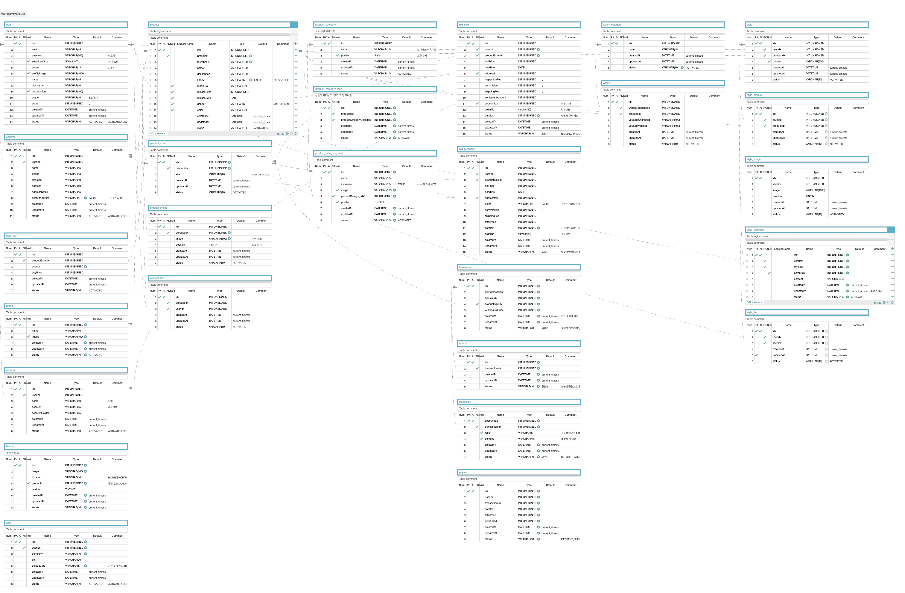

# 📱한정판 거래 플랫폼 안드로이드 앱 제작 
## 💫 프로젝트 개요
+ 한정판 거래 플랫폼 모바일 앱 크림을 벤치마킹한 안드로이드 앱 제작 팀 프로젝트(백엔드 1인, 프론트엔드 1명)에서 백엔드 담당
+ 2021.08(4주, 2인 팀프로젝트)
+ 현재 서버 운영 중지 : AWS 서버 비용 이슈
### Tech Used
```Spring Boot```, ```JPA```, ```JAVA```, ```AWS EC2```, ```AWS S3```, ```Ubuntu```, ```Nginx```, ```MySQL```, ```Memcached```, ```Github```
### 프로젝트 내용
+ AWS EC2를 활용하여 Linux(Ubuntu)기반 테스트 서버 및 프로덕트 서버 구축
+ Http, Rest API에 대한 이해를 바탕으로 직관적이며 사용이 간단한 API 설계
+ 여러 테이블을 조인해서 한번에 조회해야 하는 기능이 많아 조회 성능을 높이기 위해 데이터베이스 반정규화 및 Memcached에 캐시 처리
+ 트랜잭션을 사용하여 서버 오류에 따른 데이터 부정합 방지
+ JWT토큰 기반 인증 활용한 회원용 API 구현
+ OAuth를 활용한 카카오톡, 네이버, 구글 소셜 로그인 구현
+ API 변경이 자주 발생하더라도 최신 API를 볼 수 있도록 Swagger를 연동해 문서를 자동으로 업데이트
+ Postman을 사용해 자동 테스트 구축 및 Sentry를 연동하여 클라이언트 연동 시 발생한 오류 해결을 위한 로그 수집.
### 구현 기능
+ **HOME** 탭 : 추천 상품 조회, 상품 광고 조회, 배너 조회
+ **Style **탭 : 게시글 조회 및 작성, 댓글 조회 및 작성, 공감
+ **Shop** 탭 : 상품 조회 및 상세보기, 상품 거래 내역 조회/시세 조회, 즉시 구매/판매, 구매/판매 입찰
+ Watch 탭 : 구현 필요
+ **My** 탭 : 유저 회원가입 및 정보 관리
## 💫 ERD
+ 27개 테이블 포함
+ **사용자**와 관련된 테이블: user, address, user_own, account
+ **상품**과 관련된 테이블: product, product_size, product_image, product_like, brand, product_category, product_category_map, product_category_detail
+ **입찰**과 관련된 테이블: bid_sale, bid_purchase, transaction, refund, inspection, payment
+ **스타일** 탭과 관련된 테이블: style, style_product, style_image, style_comment, style_like
+ **와치** 탭과 관련된 테이블: watch, watch_category
+ 이미지 클릭시 자세히 보기 가능


## 💫 API 명세. 
+ 총 52개 API 구현 및 서버 반영
+ [API 명세서 보러 가기](https://docs.google.com/spreadsheets/d/14d4X2pVtZcSnpmvdMi8ux_0Voq2GrwHcsQDvc0wDPpk/edit#gid=1734576621)


## 💫 프로젝트 구조
```bash
└── src
    ├── main
    │   ├── java
    │   │   └── com
    │   │       └── example
    │   │           └── demo
    │   │               ├── KreamApplication.java
    │   │               ├── config
    │   │               │   ├── Auth.java
    │   │               │   ├── BaseException.java
    │   │               │   ├── BaseResponse.java
    │   │               │   ├── BaseResponseStatus.java
    │   │               │   ├── BaseTimeEntity.java
    │   │               │   ├── BidPrice.java
    │   │               │   ├── BidPriceValidator.java
    │   │               │   ├── DefaultInterceptor.java
    │   │               │   ├── ExceptionController.java
    │   │               │   ├── GetErrorRes.java
    │   │               │   ├── Role.java
    │   │               │   ├── Status.java
    │   │               │   └── secret
    │   │               │       ├── Secret.java
    │   │               │       └── secret.iml
    │   │               ├── src
    │   │               │   ├── WebMvcConfig.java
    │   │               │   ├── WebSecurityConfig.java
    │   │               │   ├── banner
    │   │               │   │   ├── BannerController.java
    │   │               │   │   ├── BannerProvider.java
    │   │               │   │   └── model
    │   │               │   │       ├── Banner.java
    │   │               │   │       ├── BannerRepository.java
    │   │               │   │       └── GetBannerRes.java
    │   │               │   ├── bid
    │   │               │   │   ├── BidController.java
    │   │               │   │   ├── BidProvider.java
    │   │               │   │   ├── BidService.java
    │   │               │   │   ├── purchase
    │   │               │   │   │   └── model
    │   │               │   │   │       ├── dto
    │   │               │   │   │       │   ├── GetBidPurchaseListRes.java
    │   │               │   │   │       │   ├── GetBidPurchaseRes.java
    │   │               │   │   │       │   ├── GetUserBidPurchaseListRes.java
    │   │               │   │   │       │   ├── GetUserBidPurchaseListResBid.java
    │   │               │   │   │       │   ├── PostBidPurchaseNowReq.java
    │   │               │   │   │       │   └── PostBidPurchaseNowRes.java
    │   │               │   │   │       └── entity
    │   │               │   │   │           ├── BidPurchase.java
    │   │               │   │   │           └── BidPurchaseRepository.java
    │   │               │   │   └── sale
    │   │               │   │       └── model
    │   │               │   │           ├── dto
    │   │               │   │           │   ├── GetBidSaleListRes.java
    │   │               │   │           │   ├── GetBidSaleRes.java
    │   │               │   │           │   ├── GetUserBidSaleListRes.java
    │   │               │   │           │   ├── GetUserBidSaleListResBid.java
    │   │               │   │           │   ├── GetUserBidSaleRes.java
    │   │               │   │           │   ├── PostBidSaleNowReq.java
    │   │               │   │           │   └── PostBidSaleNowRes.java
    │   │               │   │           └── entity
    │   │               │   │               ├── BidSale.java
    │   │               │   │               └── BidSaleRepository.java
    │   │               │   ├── product
    │   │               │   │   └── model
    │   │               │   │       ├── PostProductBuyRes.java
    │   │               │   │       ├── ProductController.java
    │   │               │   │       ├── ProductProvider.java
    │   │               │   │       ├── ProductService.java
    │   │               │   │       ├── dto
    │   │               │   │       │   ├── DeleteProductLikeRes.java
    │   │               │   │       │   ├── GetBrandListRes.java
    │   │               │   │       │   ├── GetBrandRes.java
    │   │               │   │       │   ├── GetImageRes.java
    │   │               │   │       │   ├── GetProductAdsRes.java
    │   │               │   │       │   ├── GetProductCategoryDetailListRes.java
    │   │               │   │       │   ├── GetProductCategoryListRes.java
    │   │               │   │       │   ├── GetProductCategoryRes.java
    │   │               │   │       │   ├── GetProductLikeRes.java
    │   │               │   │       │   ├── GetProductListProductRes.java
    │   │               │   │       │   ├── GetProductListRes.java
    │   │               │   │       │   ├── GetProductOthersListRes.java
    │   │               │   │       │   ├── GetProductOthersRes.java
    │   │               │   │       │   ├── GetProductPurchasePriceListRes.java
    │   │               │   │       │   ├── GetProductPurchasePriceRes.java
    │   │               │   │       │   ├── GetProductRecommendRes.java
    │   │               │   │       │   ├── GetProductRecommendResProduct.java
    │   │               │   │       │   ├── GetProductRes.java
    │   │               │   │       │   ├── GetProductSalePriceRes.java
    │   │               │   │       │   ├── GetProductSizeListRes.java
    │   │               │   │       │   ├── GetProductSizeRes.java
    │   │               │   │       │   ├── PostProductBuyReq.java
    │   │               │   │       │   ├── PostProductPurchaseNowReq.java
    │   │               │   │       │   ├── PostProductPurchaseNowRes.java
    │   │               │   │       │   ├── PostProductPurchaseReq.java
    │   │               │   │       │   ├── PostProductPurchaseRes.java
    │   │               │   │       │   ├── PostProductSaleNowReq.java
    │   │               │   │       │   ├── PostProductSaleNowRes.java
    │   │               │   │       │   ├── PostProductSaleReq.java
    │   │               │   │       │   ├── PostProductSaleRes.java
    │   │               │   │       │   ├── PostUserLikeReq.java
    │   │               │   │       │   ├── PostUserLikeRes.java
    │   │               │   │       │   └── PostUserOwnRes.java
    │   │               │   │       └── entity
    │   │               │   │           ├── Brand.java
    │   │               │   │           ├── BrandRepository.java
    │   │               │   │           ├── Product.java
    │   │               │   │           ├── ProductCategory.java
    │   │               │   │           ├── ProductCategoryDetail.java
    │   │               │   │           ├── ProductCategoryDetailRepository.java
    │   │               │   │           ├── ProductCategoryMap.java
    │   │               │   │           ├── ProductCategoryMapRepository.java
    │   │               │   │           ├── ProductCategoryRepository.java
    │   │               │   │           ├── ProductImage.java
    │   │               │   │           ├── ProductImageRepository.java
    │   │               │   │           ├── ProductLike.java
    │   │               │   │           ├── ProductLikeRepository.java
    │   │               │   │           ├── ProductRepository.java
    │   │               │   │           ├── ProductSize.java
    │   │               │   │           └── ProductSizeRepository.java
    │   │               │   ├── style
    │   │               │   │   ├── StyleProvider.java
    │   │               │   │   ├── StyleService.java
    │   │               │   │   └── model
    │   │               │   │       ├── StyleController.java
    │   │               │   │       ├── dto
    │   │               │   │       │   ├── GetHashTagRes.java
    │   │               │   │       │   ├── GetStyleChildCommentRes.java
    │   │               │   │       │   ├── GetStyleCommentRes.java
    │   │               │   │       │   ├── GetStyleImageRes.java
    │   │               │   │       │   ├── GetStyleLikeRes.java
    │   │               │   │       │   ├── GetStyleListRes.java
    │   │               │   │       │   ├── GetStyleProductRes.java
    │   │               │   │       │   ├── GetStyleRes.java
    │   │               │   │       │   ├── PostStyleCommentReq.java
    │   │               │   │       │   ├── PostStyleCommentRes.java
    │   │               │   │       │   ├── PostStyleLikeRes.java
    │   │               │   │       │   ├── PostStyleReq.java
    │   │               │   │       │   └── PostStyleRes.java
    │   │               │   │       └── entity
    │   │               │   │           ├── HashTag.java
    │   │               │   │           ├── HashTagRepository.java
    │   │               │   │           ├── Style.java
    │   │               │   │           ├── StyleComment.java
    │   │               │   │           ├── StyleCommentRepository.java
    │   │               │   │           ├── StyleHashTag.java
    │   │               │   │           ├── StyleHashTagRepository.java
    │   │               │   │           ├── StyleImage.java
    │   │               │   │           ├── StyleImageRepository.java
    │   │               │   │           ├── StyleLike.java
    │   │               │   │           ├── StyleLikeRepository.java
    │   │               │   │           ├── StyleProduct.java
    │   │               │   │           ├── StyleProductRepository.java
    │   │               │   │           └── StyleRepository.java
    │   │               │   ├── transaction
    │   │               │   │   └── model
    │   │               │   │       ├── TransactionController.java
    │   │               │   │       ├── TransactionProvider.java
    │   │               │   │       ├── TransactionService.java
    │   │               │   │       ├── dto
    │   │               │   │       │   ├── GetTransactionListRes.java
    │   │               │   │       │   ├── GetTransactionRes.java
    │   │               │   │       │   └── WinningBidPrice.java
    │   │               │   │       └── entity
    │   │               │   │           ├── Inspection.java
    │   │               │   │           ├── Payment.java
    │   │               │   │           ├── PaymentRepository.java
    │   │               │   │           ├── Refund.java
    │   │               │   │           ├── Transaction.java
    │   │               │   │           └── TransactionRepository.java
    │   │               │   ├── user
    │   │               │   │   ├── UserController.java
    │   │               │   │   ├── UserProvider.java
    │   │               │   │   ├── UserService.java
    │   │               │   │   └── model
    │   │               │   │       ├── dto
    │   │               │   │       │   ├── GetUserAccountRes.java
    │   │               │   │       │   ├── GetUserAddressRes.java
    │   │               │   │       │   ├── GetUserCardRes.java
    │   │               │   │       │   ├── GetUserLikeRes.java
    │   │               │   │       │   ├── GetUserLoginReq.java
    │   │               │   │       │   ├── GetUserLoginRes.java
    │   │               │   │       │   ├── GetUserOwnProduct.java
    │   │               │   │       │   ├── GetUserOwnRes.java
    │   │               │   │       │   ├── GetUserRes.java
    │   │               │   │       │   ├── PatchUserAddressReq.java
    │   │               │   │       │   ├── PatchUserProfileImageRes.java
    │   │               │   │       │   ├── PatchUserReq.java
    │   │               │   │       │   ├── PatchUserRes.java
    │   │               │   │       │   ├── PostCertificationNumberReq.java
    │   │               │   │       │   ├── PostSmsCertificationReq.java
    │   │               │   │       │   ├── PostUserAccountReq.java
    │   │               │   │       │   ├── PostUserAddressReq.java
    │   │               │   │       │   ├── PostUserCardReq.java
    │   │               │   │       │   ├── PostUserFindEmailReq.java
    │   │               │   │       │   ├── PostUserFindEmailRes.java
    │   │               │   │       │   ├── PostUserFindPasswordReq.java
    │   │               │   │       │   ├── PostUserOwnReq.java
    │   │               │   │       │   ├── PostUserReq.java
    │   │               │   │       │   └── PostUserRes.java
    │   │               │   │       └── entity
    │   │               │   │           ├── Account.java
    │   │               │   │           ├── AccountRepository.java
    │   │               │   │           ├── Address.java
    │   │               │   │           ├── AddressRepository.java
    │   │               │   │           ├── Card.java
    │   │               │   │           ├── CardRepository.java
    │   │               │   │           ├── User.java
    │   │               │   │           ├── UserOwn.java
    │   │               │   │           ├── UserOwnRepository.java
    │   │               │   │           └── UserRepository.java
    │   │               │   └── watch
    │   │               │       └── model
    │   │               │           └── entity
    │   │               │               ├── Watch.java
    │   │               │               └── WatchCategory.java
    │   │               └── utils
    │   │                   ├── AES128.java
    │   │                   ├── JwtService.java
    │   │                   ├── PasswordService.java
    │   │                   ├── RedisService.java
    │   │                   ├── S3Service.java
    │   │                   ├── SmsService.java
    │   │                   └── ValidationRegex.java
    │   ├── main.iml
    │   └── resources
    │       ├── application-aws.yml
    │       └── application.yml
    ```
